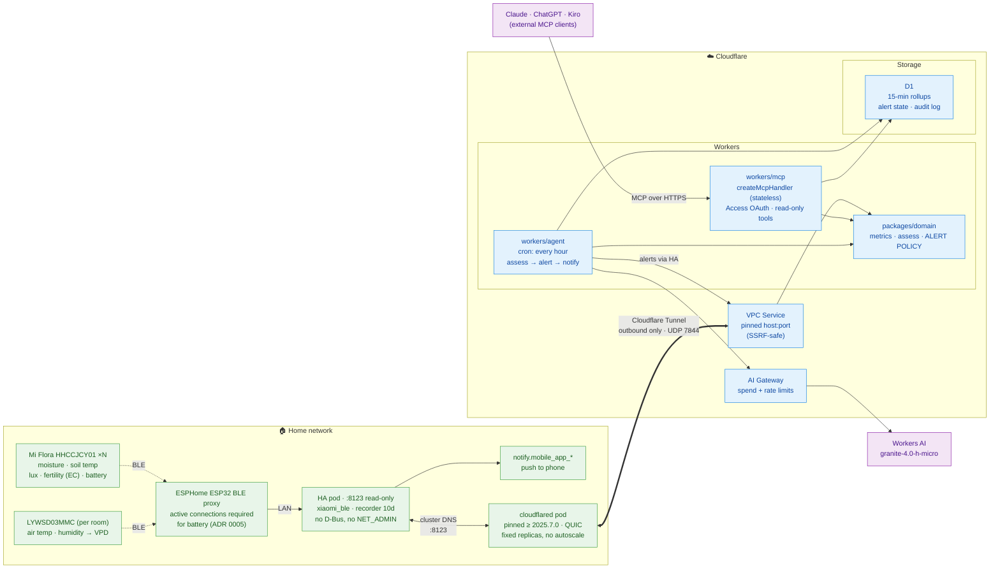

# agent-greenhopper

A plant-monitoring agent. Xiaomi Mi Flora sensors report to Home Assistant on a
Raspberry Pi; an agent on Cloudflare Workers reads that data hourly, assesses
plant health, and sends you a notification. A remote MCP server exposes the same
read capabilities to external clients such as Claude, ChatGPT, or Kiro.

**Alert-only — it does not water anything.** There is no pump and no write path to
Home Assistant. See [ADR 0003](docs/adr/0003-aleIsrt-only-no-actuation.md).

Home Assistant stays off the public internet — Workers reach it privately through
Workers VPC over a Cloudflare Tunnel.

## Architecture



> **Tip:** if you're viewing this on GitHub, the diagram renders automatically.
> For local viewing, use a Mermaid-compatible editor or see
> [`docs/architecture.svg`](docs/architecture.svg).

## Status

| Component | State |
| --- | --- |
| `packages/domain` | Complete — 99 tests, `alerts.ts` and `guardrails.ts` at 100% |
| `packages/hass` | Complete — 78 tests, read-only, 98.9% statements |
| `packages/storage` | Complete — 42 tests against real SQLite, 100% statements |
| `workers/mcp` | Complete — stateless MCP server, 6 read-only tools |
| `workers/agent` | Complete — hourly cron, assess → alert → notify pipeline |

## What it monitors

Five signals, three of which are misleading when compared raw against a
threshold:

- **Soil moisture** → dry-down slope in %/day and projected time to threshold. A
  single reading cannot tell "just watered" from "healthy and stable".
- **Soil temperature** → rolling min/max for root-zone cold stress.
- **Sunlight** → daily light integral. Instantaneous lux swings by orders of
  magnitude as clouds pass; the integrated dose is what plants respond to.
- **Fertility (EC)** → normalised to a reference moisture. EC probes measure the
  conductivity of soil *water*, so an uncorrected reading falls simply because the
  pot dried out.
- **Air temperature + humidity** → vapour pressure deficit. Requires a separate
  room sensor; Mi Flora cannot measure humidity.

---

## Deployment guide (step by step)

This section walks you through deploying the full system from zero. You'll need:

- A Cloudflare account on the **Workers Paid plan** ($5/month)
- Home Assistant running in a **Kubernetes** cluster with a Mi Flora sensor connected
- `kubectl` access to the cluster
- Node.js >= 22 and a terminal

### Step 1: Clone and verify locally

```bash
git clone https://github.com/your-org/agent-greenhopper.git
cd agent-greenhopper

# Enable the pinned package manager (no manual pnpm install needed)
corepack enable pnpm

# Install all dependencies
pnpm install

# Run the full verification suite: lint + typecheck + 219 tests
pnpm verify
```

If this passes, your local environment is correct. If it fails, check that
you're on Node >= 22 (`node --version`).

### Step 2: Prepare your Mi Flora sensors

1. **Install the Flower Care app** on your phone ([Android](https://play.google.com/store/apps/details?id=com.huahuacaocao.flowercare) / [iOS](https://apps.apple.com/app/id1095274672)).
2. **Pair each sensor** in the app and wait for the firmware update prompt.
3. **Update firmware to >= 3.2.1** (Hardware settings → Hardware update).
4. You can delete the app afterwards — it's only needed for the firmware update.

> **Why this matters:** firmware below 3.2.1 does not emit the correct BLE
> beacons, so Home Assistant will never see the sensor. The agent's `checkSetup()`
> will detect this automatically once running.

### Step 3: Set up ESPHome Bluetooth proxies

Mi Flora data arrives over BLE, but a containerised Home Assistant cannot access
Bluetooth directly without elevated privileges. ESPHome ESP32 proxies solve this.

1. **Get an ESP32 board** — the [Olimex ESP32-POE-ISO](https://www.olimex.com/Products/IoT/ESP32/ESP32-POE-ISO/open-source-hardware)
   is recommended by Home Assistant for best reliability. A generic ESP32-WROOM
   works too but is Wi-Fi only.
2. **Flash ESPHome** via https://esphome.io/projects/?type=bluetooth — choose
   "Bluetooth Proxy" from the ready-made projects.
3. **Connect to your network** — PoE boards get power and network from one cable;
   Wi-Fi boards need a USB power source.
4. **Adopt in Home Assistant** — the proxy will appear automatically under
   Settings → Devices → ESPHome. Accept it.
5. **Place near your plants** — BLE range is ~10 metres; walls reduce it
   significantly. One proxy per room with plants.

> **Important:** the proxy must be ESP32 running ESPHome, not Shelly or SMLIGHT.
> Those cannot make active BLE connections, which means Mi Flora battery level
> would be lost. See [ADR 0005](docs/adr/0005-container-deployment-and-ble-proxies.md).

### Step 4: Verify sensors in Home Assistant

Once proxies are running:

1. Go to **Settings → Devices & Services → Xiaomi BLE**.
2. Each Mi Flora should appear automatically. If not, check the proxy is online
   and the sensor firmware is updated.
3. Note the **device name** for each sensor — for example `Monstera Flower Care`.
   This determines the entity IDs (e.g. `sensor.monstera_flower_care_moisture`).
4. If you have a room climate sensor (e.g. LYWSD03MMC), verify it shows
   temperature and humidity.

### Step 5: Create a dedicated Home Assistant user

For security, create a user that only has access to plant entities:

1. Go to **Settings → People → Add Person**.
2. Create a user named `greenhopper` with a password.
3. Go to the user's **Security** tab → **Long-lived access tokens** → **Create token**.
4. **Copy and save the token** — you'll need it in step 7. You cannot see it again.

> The token is what the Workers use to read sensor data. It should belong to a
> non-admin user so that even if it leaks, the blast radius is limited.

### Step 6: Deploy cloudflared to your Kubernetes cluster

This creates the private tunnel that Workers use to reach Home Assistant.

```bash
# Create the namespace
kubectl create namespace greenhopper

# Create a tunnel in the Cloudflare dashboard:
#   Zero Trust → Networks → Tunnels → Create a tunnel
#   Choose "Cloudflare Tunnel" type, name it "greenhopper"
#   Copy the tunnel token shown in the setup wizard

# Store the token as a Kubernetes secret
kubectl -n greenhopper create secret generic cloudflared-tunnel \
  --from-literal=token='YOUR_TUNNEL_TOKEN_HERE'

# Deploy cloudflared
kubectl apply -f deploy/kubernetes/cloudflared.yaml

# (Optional) Apply network policy if your cluster has default-deny egress
kubectl apply -f deploy/kubernetes/networkpolicy-cloudflared.yaml

# Verify the tunnel is connected
kubectl -n greenhopper logs -l app.kubernetes.io/name=cloudflared --tail=20
```

Look for `Registered tunnel connection` and `protocol: quic`. If it says
`protocol: http2`, outbound UDP 7844 is blocked — the tunnel works but Workers
VPC will not.

### Step 7: Create the VPC Service in Cloudflare

This tells Workers how to reach Home Assistant through the tunnel.

1. Go to **Cloudflare dashboard → Workers & Pages → Workers VPC → VPC Services**.
2. Click **Create Service** with these settings:
   - **Name:** `home-assistant`
   - **Type:** HTTP
   - **HTTP Port:** 8123
   - **Host:** the in-cluster DNS name of your HA service, e.g.
     `home-assistant.home-assistant.svc.cluster.local`
   - **Tunnel:** select the tunnel you created in step 6
3. **Copy the Service ID** — you'll need it in the next step.

> You do not need to set resolver IPs. The cloudflared pod uses cluster DNS
> automatically, so Kubernetes Service names resolve without extra config.

### Step 8: Create the D1 database

```bash
# Install wrangler globally if you haven't
npm install -g wrangler

# Authenticate with Cloudflare
wrangler login

# Create the database
wrangler d1 create greenhopper

# Note the database ID in the output, then run the migration
wrangler d1 execute greenhopper --remote \
  --file packages/storage/migrations/0001_init.sql
```

### Step 9: Configure and deploy the MCP server

```bash
cd workers/mcp
```

Edit `wrangler.jsonc` — replace the placeholder values:

```jsonc
{
  "vpc_services": [
    { "binding": "HASS", "service_id": "YOUR_VPC_SERVICE_ID", "remote": true }
  ],
  "d1_databases": [
    { "binding": "DB", "database_name": "greenhopper", "database_id": "YOUR_D1_DATABASE_ID" }
  ]
}
```

Set secrets and variables:

```bash
# The Home Assistant long-lived access token from step 5
wrangler secret put HASS_TOKEN

# The HA base URL as seen from the tunnel (in-cluster address)
wrangler secret put HASS_BASE_URL
# When prompted, enter: http://home-assistant.home-assistant.svc.cluster.local:8123
```

Deploy:

```bash
wrangler deploy
```

The MCP server is now live at `https://greenhopper-mcp.YOUR_SUBDOMAIN.workers.dev/mcp`.

### Step 10: Configure and deploy the agent

```bash
cd ../agent   # or cd workers/agent from the project root
```

Edit `wrangler.jsonc` with the same VPC Service ID and D1 database ID as the MCP
server.

Set secrets:

```bash
wrangler secret put HASS_TOKEN
wrangler secret put HASS_BASE_URL
# Same values as the MCP server
```

Deploy:

```bash
wrangler deploy
```

The agent starts running on the next hour boundary (cron `0 * * * *`). You can
trigger it manually to verify:

```bash
curl https://greenhopper-agent.YOUR_SUBDOMAIN.workers.dev/run
```

### Step 11: Configure your plant registry

Currently the plant registry is hardcoded in both Workers. To add your actual
plants, edit the `PLANT_REGISTRY` and `ENTITY_REGISTRY` arrays in:

- `workers/mcp/src/index.ts`
- `workers/agent/src/index.ts`

Example for adding a fern:

```typescript
// In PLANT_REGISTRY:
{
  id: 'fern',
  name: 'Boston Fern',
  species: 'Nephrolepis exaltata',
  room: 'bathroom',
  targets: {
    moisture: { min: 40, max: 70 },
    soilTemp: { min: 15, max: 25 },
    dli: { min: 1, max: 6 },
    vpd: { min: 0.3, max: 1.0 },
    conductivity: { min: 200, max: 1000 },
  },
  watering: DEFAULT_WATERING_POLICY,
},

// In ENTITY_REGISTRY:
miFloraEntities({
  plantId: 'fern',
  deviceSlug: 'boston_fern_flower_care',  // from HA device name
  airSensorSlug: 'bathroom_climate',      // your room sensor
}),
```

After editing, redeploy both Workers:

```bash
cd workers/mcp && wrangler deploy
cd ../agent && wrangler deploy
```

### Step 12: Connect MCP clients (optional)

You can ask Claude, ChatGPT, or Kiro about your plants by connecting them to the
MCP server.

**Claude Desktop:**

Edit `~/Library/Application Support/Claude/claude_desktop_config.json`:

```json
{
  "mcpServers": {
    "greenhopper": {
      "command": "npx",
      "args": [
        "mcp-remote",
        "https://greenhopper-mcp.YOUR_SUBDOMAIN.workers.dev/mcp"
      ]
    }
  }
}
```

Restart Claude Desktop. You can now ask things like:

- "How is my monstera doing?"
- "Show me the moisture trend for the last week"
- "Are any sensors reporting problems?"

### Step 13: Set up cost controls (recommended)

The agent runs within the free Neuron allocation (~921/day out of 10,000 free),
so inference costs $0. But as a safety net:

1. **AI Gateway spend limit:** Dashboard → AI → AI Gateway → Settings →
   Spend limits → Add rule → $2/day, block on exceed.
2. **AI Gateway rate limit:** Same page → Rate limiting → 5 requests/minute,
   fixed window.
3. **Budget alert:** Manage Account → Billing → Billable Usage → Create budget
   alert → $10 threshold. (This only emails you, it does not stop anything.)

### Step 14: Verify everything works

After the first hourly run (or after curling `/run`):

1. **Check logs:** Dashboard → Workers & Pages → greenhopper-agent → Logs.
   You should see the pipeline completing without errors.
2. **Check D1:** `wrangler d1 execute greenhopper --remote --command "SELECT COUNT(*) FROM readings"`
   — should show rows being populated.
3. **Check alerts:** `wrangler d1 execute greenhopper --remote --command "SELECT * FROM notifications ORDER BY at DESC LIMIT 10"`
4. **Check your phone** — if a plant has a problem, you'll get a push notification.
   If everything is healthy, silence is correct.

---

## Troubleshooting

| Symptom | Likely cause | Fix |
| --- | --- | --- |
| Agent logs show `HassError: unreachable` | Tunnel not connected, or VPC Service misconfigured | Check `kubectl logs` for cloudflared; verify Service ID |
| Agent logs show `401` | HASS_TOKEN is wrong or expired | Regenerate the long-lived token in HA |
| No readings in D1 after an hour | Sensors are `unavailable` in HA | Check BLE proxy is online and in range |
| Getting the same notification every hour | Alert state not persisting | Verify D1 migration ran (`SELECT * FROM alert_state`) |
| No notifications at all | No notify service found | Install the HA companion app on your phone |
| `pnpm verify` fails on a fresh clone | Wrong Node version | Check `node --version` is >= 22 |

---

## Documentation

- [`docs/architecture.md`](docs/architecture.md) — full design, cost model,
  hardware quirks
- [`AGENTS.md`](AGENTS.md) — conventions, layering rules, commands. Read this
  before contributing.
- [`docs/adr/`](docs/adr/) — architecture decision records
- [`deploy/kubernetes/README.md`](deploy/kubernetes/README.md) — Kubernetes
  deployment details and troubleshooting
- [`deploy/terraform/README.md`](deploy/terraform/README.md) — Infrastructure as
  Code: Tunnel, VPC Service, D1, state in R2

## Safety

The system is **read-only** against Home Assistant. No code issues a write and no
MCP tool mutates state — that is the primary safety property, and it is what makes
the design trivially auditable.

The secondary concern is not drowning you in notifications, which is the real
failure mode of an alert-only system. `packages/domain/src/alerts.ts` enforces
dedup per (plant, finding), severity-scaled re-notify intervals, immediate
delivery when a condition worsens, one-shot recovery notices, and quiet hours that
critical findings always override. None of it lives in a prompt.

`guardrails.ts` holds dormant watering constraints for a possible future. It has
no caller — see [ADR 0003](docs/adr/0003-alert-only-no-actuation.md).

## License

MIT
