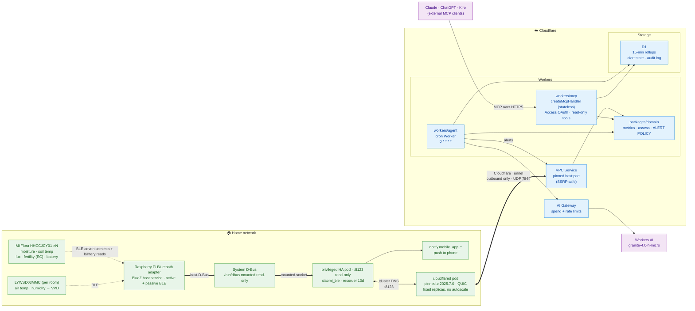

# agent-greenhopper — Architecture

Plant-monitoring agent. Home Assistant on a Raspberry Pi holds the sensors;
the agent and MCP server run on Cloudflare Workers and reach HA privately
through Workers VPC over an existing Cloudflare Tunnel.

**Alert-only: this system does not water plants.** There is no pump and no write
path to Home Assistant. See [ADR 0003](adr/0003-alert-only-no-actuation.md).

## Diagram



## Key decisions

| Decision | Why |
| --- | --- |
| Workers VPC, not a public HA hostname | HA stays off the internet; VPC Services pin routing to one host:port, so a compromised Worker cannot scan the LAN. Free during open beta. |
| **Alert-only, no actuation** (ADR 0003) | Blast radius drops to "noisy notification" instead of "drowned plant". `guardrails.ts` stays dormant and tested for a possible future. |
| `createMcpHandler`, not `McpAgent` | `McpAgent` is deprecated and feature-frozen. Stateless handler = no MCP session; durable state goes to D1. |
| Alert policy in `packages/domain` | Suppression, escalation, quiet hours and recovery are enforced in code the LLM cannot route around — not in the prompt. |
| Agent imports domain directly | MCP between two Workers you own adds a hop and auth for no isolation gain. Same functions are exposed as MCP tools for external clients. |
| D1 rollups every 15 min | HA's recorder purges detail after ~10 days. D1 gives multi-month trends, which is what makes dry-down comparison possible. |
| `granite-4.0-h-micro` via AI Gateway (ADR 0004) | Cheapest function-calling model, 9% of the free Neuron allocation. Gateway is what makes spend and rate limits apply. |

## Control flow (hourly)

1. Cron Trigger fires the `checkPlants` pipeline.
2. Agent reads current state from HA via the VPC binding, and trend history from D1.
3. `derive()` converts raw signals into VPD, DLI, dry-down slope, and normalised EC.
4. `assess()` runs the deterministic rules, producing severity-tagged findings.
   Sensor faults are evaluated first; plant condition is not judged from a probe
   already known to be broken.
5. If `escalate` is true, the model is called through AI Gateway for a readable
   explanation. Otherwise the rule messages are used verbatim.
6. `planAlerts()` compares findings against stored alert state and decides what to
   send, suppress, or mark recovered.
7. Notifications go out through Home Assistant's own `notify` service; alert state
   and an audit row are written to D1.

## Cost pointer

Short answer: **~$5/month on Cloudflare.** Every component lands inside the
Workers Paid included allowances, so the bill is the $5 account minimum. The
real variable cost is LLM tokens, which are billed by the model provider, not
Cloudflare.

Assumed workload: 8 plants × 4 sensors, telemetry poll every 15 min, agent
reasoning run hourly.

| Component | Projected usage | Included in Workers Paid | Cost |
| --- | --- | --- | --- |
| Workers Paid plan | — | — | **$5.00** (account minimum) |
| Worker requests | ~4k/mo | 10M/mo | $0 |
| Worker CPU time | ~0.7M CPU-ms/mo | 30M CPU-ms/mo | $0 |
| D1 rows written | ~24k/mo | 50M/mo | $0 |
| D1 rows read | ~4M/mo | 25B/mo | $0 |
| D1 storage | < 50 MB | 5 GB | $0 |
| Workers VPC | 1 service | free during open beta | $0 |
| Cloudflare Tunnel | 1 tunnel | free | $0 |
| Workers Logs | ~10k events/mo | 20M events/mo | $0 |

Headroom is large — all line items sit at roughly 1% or less of the included
allowances, so this design could run ~80× more often before Cloudflare usage
charges begin.

### LLM tokens

**Chosen model: `@cf/ibm-granite/granite-4.0-h-micro`** (ADR 0004) — 131k context,
function calling, $0.017/M input and $0.11/M output.

Workers AI includes a free allocation of **10,000 Neurons/day** on both Free and
Paid plans ($0.011 per 1,000 beyond it, Paid only). At ~15k input + ~1.5k output
tokens per run, 24 runs/day:

| Model | Neurons/run | Neurons/day | Verdict |
| --- | --- | --- | --- |
| **`granite-4.0-h-micro`** (chosen) | **38** | **921** | **fits — 9% of free** |
| `qwen3-30b-a3b-fp8` | 115 | 2,762 | fits — 28% |
| `glm-4.7-flash` | 137 | 3,290 | fits — 33% |
| `gpt-oss-20b` | 314 | 7,527 | fits — 75% |
| `llama-3.3-70b-fp8-fast` | 707 | 16,973 | over → ~$2.30/mo |

Inference is therefore **$0** at this workload, with a 10x margin. Alert-only
scope is what makes the smallest model defensible: it summarises and explains
rather than deciding to actuate, so weak judgement produces a slightly worse
notification, not a dead plant.

Fallbacks if reasoning quality disappoints: `qwen3-30b-a3b-fp8` or
`glm-4.7-flash`, both still inside the free allocation and both adding reasoning
capability. Some frontier models (`kimi-k2.6`, `glm-5.2`, `deepseek-v4-*`) require
a paid billing method regardless of allocation.

Note that gating matters more than model choice: deterministic rules run first and
the model is called only when `assess()` returns `escalate: true`, cutting
invocations roughly 25x.

Neuron allocation resets daily at 00:00 UTC. On the Workers Free plan, exceeding
it makes further inference calls fail rather than bill you.

### Cost controls — hard caps vs alerts

Cloudflare offers both, and only one actually stops anything.

**Hard caps (block requests):**

| Control | Effect |
| --- | --- |
| AI Gateway **Spend limits** (Beta) | Dollar budget per rolling/fixed window; blocks with `429`. Up to 20 rules/gateway, scopeable by model, provider, or custom metadata. Can fall back to a cheaper model via Dynamic Routing instead of blocking. |
| AI Gateway **Rate limiting** | Caps request count per window (fixed or sliding); `429`. Fastest guard against a runaway loop. |
| Workers `limits.cpu_ms` | Per-invocation CPU ceiling, set in Wrangler config. |
| Workers AI free allocation on Workers **Free** plan | Hard ceiling — calls fail rather than bill. On Paid it bills instead. |

**Alerts only (do NOT stop anything):**

- **Budget alerts** — account-wide dollar threshold, email only. Cloudflare's
  docs: *"Budget alerts are informational only. They do not pause or cap
  usage."* Pay-as-you-go accounts only; a default $10 alert is now auto-created.
- **Usage notifications** — per-product metric thresholds, under Notifications.

Do not treat a budget alert as protection; it reports after the fact.

**Recommended for greenhopper:** Currently calls `env.AI` directly. For
production, route through AI Gateway to get spend and rate limits — that is what
makes them apply, and it gives you request logs. Then set a spend limit of
~$2/day, a rate limit of ~5 req/min (60× headroom over the one call/hour the
design needs), `limits.cpu_ms: 30000`, and a $10 budget alert as an email
backstop.

The financial exposure here is small, and with `granite-4.0-h-micro` inside the
free Neuron allocation the LLM cost is zero. The remaining runaway risk is
notification spam rather than money or hardware — the system cannot actuate
anything (ADR 0003). That risk is handled by `alerts.ts`, not by billing controls.

## Monitored signals

Five measurement domains. Each needs different handling — this is the core of
the data model, because a naive "read value, compare to threshold" approach
gives wrong answers on three of the five.

| Signal | Source | Unit | Cadence | Derived metric that actually matters |
| --- | --- | --- | --- | --- |
| Soil moisture | Mi Flora | % | ~1 min passive | **Dry-down slope** (%/day) and time-to-threshold, not the instantaneous value |
| Soil temperature | Mi Flora | °C | ~1 min passive | Rolling min/max; root-zone cold stress |
| Sunlight | Mi Flora | lux | ~1 min passive | **DLI** — integrated over the photoperiod (relative, see caveat) |
| Fertility (EC) | Mi Flora | µS/cm | ~1 min passive | Trend at *comparable moisture* only (see gotcha below) |
| Battery | Mi Flora | % | **once daily, active connection** | Replace-soon warning; needs its own staleness rule |
| Air humidity | **separate sensor** | % RH | ~1–10 min | Combined with air temp into **VPD** |
| Air temperature | **separate sensor** | °C | ~1–10 min | Combined with RH into **VPD** |

Mi Flora broadcasts all four soil/light signals passively at roughly one reading
per minute. Rolled up to 15-minute buckets in D1, that is ample resolution and
keeps row counts trivial.

### Why the derived metrics, not raw readings

**Moisture** — a single reading cannot distinguish "just watered and draining"
from "stable and healthy". The slope can. Fit a line over the last 24–48 h; a
steepening slope means rising transpiration or a root-bound pot, and a flat
slope near saturation means poor drainage. Watering decisions come from
projected time-to-dry, not current %.

**Light** — instantaneous lux is nearly meaningless for plant health because it
swings orders of magnitude as clouds pass. What a plant responds to is the
total daily photon dose. Integrate lux over the latest complete rolling 24-hour
window into a DLI estimate and compare day-over-day. With less than 23 hours of
coverage, report no DLI instead of a false low-light warning. A week of low DLI
explains leggy growth; one dark afternoon explains nothing.

**Temp + humidity → VPD** — vapour pressure deficit is the actual driver of
transpiration, and it is a function of both. 25 °C at 40% RH and 25 °C at 80%
RH are completely different environments for a plant. Compute VPD and treat it
as a first-class signal; keep raw temp and RH for diagnostics.

**Fertility (EC) — the important gotcha:** cheap soil conductivity probes
measure the conductivity of soil *water*, so the reading rises and falls with
moisture content. Comparing an EC reading taken in dry soil against one taken
just after watering is meaningless. Two options: only compare EC readings
sampled within a narrow moisture band (for example, moisture within ±3% of
each other), or store EC alongside its moisture reading and normalise. The
schema below keeps them on the same row so this stays possible.

### D1 schema sketch

```sql
CREATE TABLE readings (               -- 15-min rollups, long-term history
  plant_id     TEXT NOT NULL,
  ts           INTEGER NOT NULL,      -- unix seconds, bucket start
  moisture_pct REAL,
  soil_temp_c  REAL,
  air_temp_c   REAL,
  humidity_pct REAL,
  lux          REAL,
  ec_us_cm     REAL,                  -- fertility
  battery_pct  REAL,
  PRIMARY KEY (plant_id, ts)
);

CREATE TABLE daily (                  -- one row per plant per day
  plant_id   TEXT NOT NULL,
  day        TEXT NOT NULL,           -- YYYY-MM-DD
  dli_est    REAL,                    -- integrated light
  vpd_mean   REAL,
  vpd_max    REAL,
  dry_slope  REAL,                    -- %/day, fitted
  ec_at_ref  REAL,                    -- EC normalised to reference moisture
  watered_ml REAL,
  PRIMARY KEY (plant_id, day)
);

CREATE INDEX idx_readings_ts ON readings (ts);
```

Keeping `ec_us_cm` on the same row as `moisture_pct` is deliberate — it is what
makes moisture-normalised fertility trends computable after the fact.

### MCP tool surface

```
list_plants()                                  -> plant registry + species targets
get_plant_snapshot(plant_id)                   -> all 5 signals + staleness + battery
get_plant_history(plant_id, signal, window)    -> downsampled series from D1
get_plant_trends(plant_id)                     -> dry_slope, DLI 7d, VPD, EC trend
get_sensor_health(plant_id)                    -> stale? battery low? out of range?
get_active_alerts()                            -> current findings and alert state
```

Every tool is read-only. There is no `water_plant` and no tool that mutates Home
Assistant state — that is the primary safety property of this design (ADR 0003).

Per-species targets (min/max moisture, DLI range, EC range) live in the plant
registry, not in the prompt — a fern and a succulent share no thresholds.

## Alert policy

An alert-only system fails by being ignored, not by missing a reading. The agent
runs hourly but a dry plant stays dry for days, so naive notification would send
the same message 24 times a day. `packages/domain/src/alerts.ts` prevents that:

| Behaviour | Rule |
| --- | --- |
| Dedup | State is keyed on (plant, finding code) |
| Re-notify interval | critical 24 h · warn 72 h · info 7 d |
| Escalation | A worsening severity notifies immediately, overriding the interval |
| Recovery | A cleared condition sends exactly one notice, then its state is dropped so a recurrence is "new" again |
| Quiet hours | Default 22:00–07:00 suppresses warnings — but **never** critical findings |
| Channel | Below `warn` goes to a digest rather than a push |

Peak severity is remembered per episode, so a condition that worsens and then
partially improves does not re-trigger.

### Hardware: Xiaomi Mi Flora (HHCCJCY01)

Integrated via HA's **Xiaomi BLE** (`xiaomi_ble`) integration. Because Home
Assistant runs as a privileged Kubernetes pod and uses the Raspberry Pi's host
Bluetooth adapter through a read-only `/run/dbus` mount — see ADR 0006. BlueZ
stays on the host; the HA pod must be scheduled to that node.

Five quirks that shape the code:

**1. No air humidity.** Mi Flora measures moisture, soil temperature,
illuminance, and conductivity only. VPD is impossible from it alone. Add one
`LYWSD03MMC` per room (also `xiaomi_ble`, inexpensive) — VPD is a room-level
property, so one per room covers every plant in it. Note Mi Flora's temperature
is *probe* temperature, not air temperature; don't substitute it.

**2. Battery is active-connection only, once per day.** Every other signal is
passive broadcast, but battery requires HA to connect and read characteristics.
HA does this once daily to preserve battery life, and it needs good signal
strength. Consequence: `get_sensor_health` must apply **per-signal staleness
thresholds** — 10 minutes for moisture/lux/EC, 48 hours for battery. A single
"last updated" check will produce constant false alarms.

**3. Firmware ≥ 3.2.1 required.** Older firmware does not emit the correct BLE
beacons and the device will not work. Update via the official Flower Care app
(HHCC) before anything else; the account is not needed afterwards.

**4. Lux is soil-level and uncalibrated.** The sensor sits at soil level facing
up, so it reads far below canopy PAR. DLI is therefore **relative** — excellent
for "this plant gets 60% of the light it got in June", useless for comparing
against published DLI tables per species. Set targets empirically from your own
baseline, not from literature.

**5. Probe degradation is the standard failure mode.** Electrodes corrode. Watch
for: a value pinned at a range extreme (moisture 0% or 100%) for hours, EC
reading wildly, or — the best detector — **moisture failing to rise within
~30 min of a logged watering event**. That last check catches a dead probe
definitively and should be an explicit rule in `get_sensor_health`.

Also note EC reads near zero in very dry soil, which compounds the
moisture-confound problem in gotcha 4 above. Expect ~12 months of battery life.
The Raspberry Pi adapter's BLE range is roughly 10 m and degrades badly through
walls, so adapter placement is part of the deployment design.

### D1 schema

Migrations live in `packages/storage/migrations/`. Four tables:

```sql
readings       -- one row per plant per 15-min bucket; a column per signal
daily          -- per-plant daily aggregates: DLI, VPD mean/max, dry rate, EC
alert_state    -- (plant_id, code) -> first_seen_at, last_notified_at, peak_severity
notifications  -- append-only audit of notify / suppress / resolve
```

Three decisions worth knowing:

**`readings` is wide, not narrow.** A column per signal rather than
`(plant, ts, signal, value)` rows. D1 bills rows read and written, and the narrow
shape multiplies both by seven for a fixed set of seven signals. Air temperature
and humidity are duplicated across plants sharing a room sensor so that every
query stays single-table.

**The upsert coalesces.** `COALESCE(excluded.battery_pct, readings.battery_pct)`
and so on for each column. Battery arrives once a day while soil signals arrive
every minute, so most updates legitimately carry gaps — without this, a later
write would erase the stored battery value.

**Resolved alerts are deleted, not flagged.** The domain treats absent state as
"this is new", which is precisely the desired behaviour when a problem recurs
after clearing. `AlertStateRepository.replaceForPlants` is scoped to the plants
processed in a run so a partial run cannot wipe everyone else's history.

Storage tests execute the real DDL and real queries against real SQLite through
`node:sqlite`, since D1 is SQLite. The adapter sits behind a separate
`@greenhopper/storage/testing` entry point so `node:sqlite` never reaches a Worker
bundle.

## Prerequisites to verify first

- `cloudflared` image tag pinned to >= 2025.7.0, QUIC transport (`auto` or `quic`), outbound UDP 7844 permitted, fixed replica count (no autoscaling).
- VPC Service pointed at Home Assistant's in-cluster address (for example `home-assistant.<ns>.svc.cluster.local:8123`) — no Ingress or public hostname needed.
- Mi Flora firmware >= 3.2.1 on every unit (check via Flower Care app → Hardware settings → Hardware update).
- BlueZ running on the Raspberry Pi host; the privileged HA pod mounts
  `/run/dbus` read-only and is scheduled to the Bluetooth adapter's node (ADR 0006).
- One air temp/humidity sensor per room for VPD.
- A dedicated Home Assistant user with only plant entities exposed; long-lived token stored as a Worker secret.
